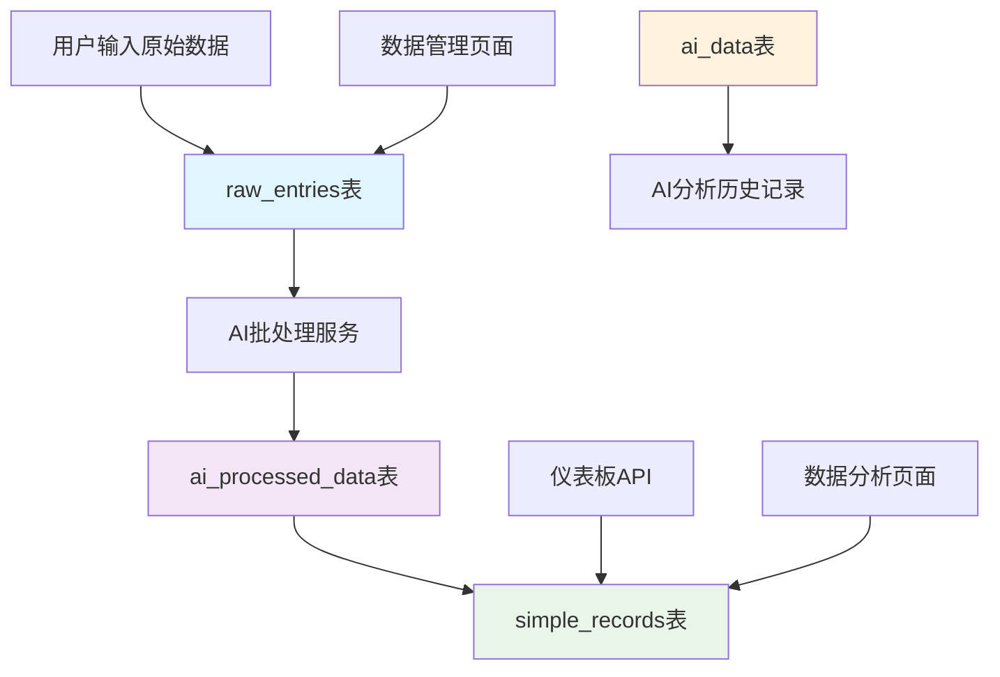
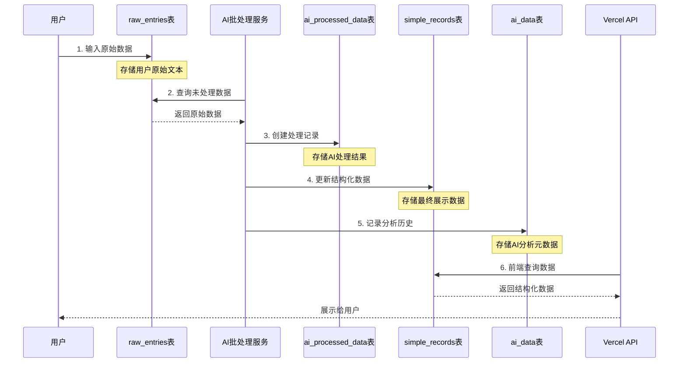

# Turso数据库表关系图

## 数据流程图

## 表结构关系

```mermaid
erDiagram
    raw_entries {
        int id PK
        string date
        text mood_text
        text fitness_text
        text study_text
        text work_text
        text inspiration_text
        text raw_text
        datetime created_at
        datetime processed_at
        string source
    }
    
    ai_processed_data {
        int id PK
        int raw_entry_id FK
        string date
        int mood_score
        string mood_emoji
        text mood_description
        int life_score
        int study_score
        int work_score
        int inspiration_score
        text summary
        string ai_model
        datetime processed_at
    }
    
    simple_records {
        int id PK
        string date
        text mood_description
        text life_description
        text study_description
        text work_description
        text inspiration_description
        string mood_emoji
        string mood_event
        int mood_score
        string mood_category
        string fitness_intensity
        string fitness_duration
        string fitness_calories
        string fitness_type
        string study_duration
        string study_category
        text work_ai_summary
        text work_summary
        string work_task_type
        string work_priority
        string work_complexity
        int work_estimated_hours
        string inspiration_theme
        string inspiration_product
        string inspiration_difficulty
        string inspiration_progress
        string overall_sentiment
        int energy_level
        int productivity_score
        int life_balance_score
        int data_quality_score
        text fitness_description
        datetime created_at
    }
    
    ai_data {
        int id PK
        string date
        string category
        string analysis_type
        text result
        real confidence_score
        datetime created_at
    }
    
    raw_entries ||--o{ ai_processed_data : "一对多"
    ai_processed_data ||--|| simple_records : "一对一"
    simple_records ||--o{ ai_data : "一对多"
```

## 处理流程详解

## 表的作用说明

### 1. raw_entries (原始数据表)
- **作用**: 存储用户输入的原始文本数据
- **数据来源**: iPhone快捷指令、手动输入
- **特点**: 保持原始格式，便于追溯和编辑

### 2. ai_processed_data (AI处理结果表)
- **作用**: 存储AI批处理的中间结果
- **数据来源**: 对raw_entries的AI分析
- **特点**: 包含AI分析的各种评分和总结

### 3. simple_records (主要数据表)
- **作用**: 存储最终的结构化数据，供前端展示
- **数据来源**: 整合ai_processed_data的结果
- **特点**: 包含完整的用户数据，支持各种查询和分析

### 4. ai_data (AI分析历史表)
- **作用**: 记录AI分析的历史和元数据
- **数据来源**: AI处理过程中的分析记录
- **特点**: 用于分析质量评估和系统优化

## 数据流向

1. **数据输入**: 用户 → raw_entries
2. **AI处理**: raw_entries → ai_processed_data
3. **数据整合**: ai_processed_data → simple_records
4. **历史记录**: 处理过程 → ai_data
5. **前端展示**: simple_records → 用户界面
